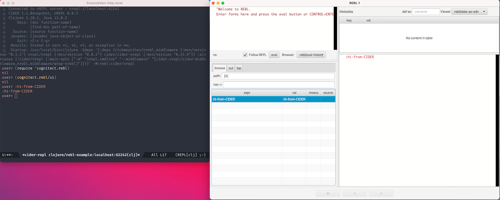

## REBL with CIDER example

How to use

Follow the instructions at [datomic cloud documentation](https://docs.datomic.com/cloud/other-tools/REBL.html#installation) to get a copy of rebl. This just follows their example with how to configure CIDER with these instructions and then uses the helpful [middleware](https://github.com/RickMoynihan/nrebl.middleware) by Ricky Moynihan to get things running.

### Their Instructions

1. Add the deps to your deps edn (see the deps edn in this repo)
2. `clojure -M:rebl -m cognitect.rebl`

### How to do this in CIDER

1. specify the rebl profile. `(cider-clojure-cli-aliases . "rebl")` in .dir-locals
2. ensure the middleware is present in our project: `(cider-jack-in-dependencies . (("rickmoynihan/nrebl.middleware" "0.3.1") ("nrepl/nrepl" "0.8.3")))`
3. ensure the middleware is present to run nrebl: `(cider-jack-in-nrepl-middlewares . ("cider.nrepl/cider-middleware" "nrebl.middleware/wrap-nrebl"))`
4. Once your repl starts, do `(require 'cognitect.rebl)` and then `(cognitect.rebl/ui)`

You can see what these variables are by doing `m-x describe-variable cider-jack-in-dependencies` (or `C-h v cider-jack-in-dependencies`).

### Why we are doing this

CIDER just runs some simple commands on top of `clojure`. It needs nrepl and its own middleware in order to provide all the goodies we expect. We can easily add more: by adding to `cider-jack-in-dependencies` and `cider-jack-in-nrepl-middlewares`. The names are hopefully very descriptive.

The top of the repl should display the actual command that was run:

> Startup: /usr/local/bin/clojure -Sdeps '{:deps {rickmoynihan/nrebl.middleware {:mvn/version "0.3.1"} nrepl/nrepl {:mvn/version "0.8.3"} cider/cider-nrepl {:mvn/version "0.25.9"}} :aliases {:cider/nrepl {:main-opts ["-m" "nrepl.cmdline" "--middleware" "[cider.nrepl/cider-middleware,nrebl.middleware/wrap-nrebl]"]}}}' -M:rebl:cider/nrepl

Squint, and you'll see

`clojure -Sdeps {:deps {nrebl.middleware nrepl cider-nrepl} :aliases {cider-nrepl ["nrepl.cmdline" "--middleware"}}} -M:rebl:cider/nrepl`

This pseudo-code command just says "start up clojure, using these extra deps so CIDER and nrebl can do their thing, with main "nrepl.cmdline --middleware <bunch of middleware>". The `-M:rebl:cider/nrepl` at the end puts all of the aliases we care about and ensures that cider/nrepl is last so the main for nrepl is the main that actually runs.

